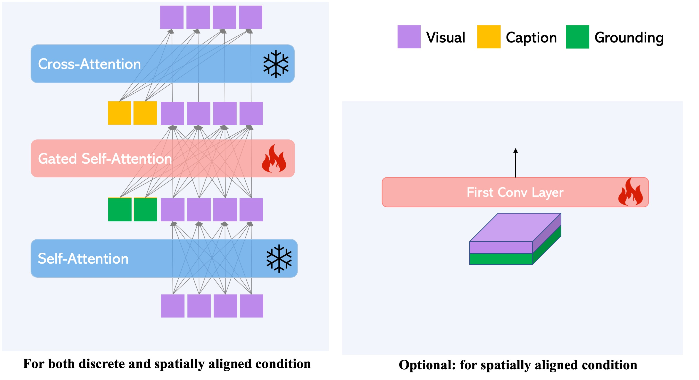

GLIGEN gives users the most flexibility to design their own grounded T2I models, thus there is no strict constraints on how to design dataset, dataloader or models etc. We first explain all data we used in this project; then we give a briefy introduction to what users need to implement if wants to train GLIGEN model on custom modalities. 


## DATA 

Before downloading data, one may have the question where should I put the data or where I should specify the path? The answer is you can put it anyway you want. Since we have varies modailties and datasets, we register each dataset into `dataset/catalog.py`. For example the following is an example for the SBU box grounding dataset. Specially, each registered dataset needs to have "target" specifying which class to call and "train_params" which is kwargs

```python
       SBUGrounding = {   
           "target": "dataset.tsv_dataset.TSVDataset",
           "train_params":dict(
               tsv_path=path_to_preprocess_tsv, # Check below section, we provide the tsv to download.  
           ),
        }
```

### Bounding boxes grounding 

This is the primiary modality we study in this paper. We use the following datasets and they are all provided in the TSV format. These data are used for all box related models training, such as box text/image grounded generation/inpainting. 


- 1) [Flickr](#): The original dataset provides caption annotations for images and key nouns in captions are associated with bounding boxes.  
- 2) [VG](#): Grounding annotations are curated by [MDETR](https://github.com/ashkamath/mdetr/blob/main/.github/pretrain.md) from VQA and other annotations from orginal dataset.  
- 3) [SBU](#): Image text pairs dataset. We obtain bounding boxes using [GLIP](https://github.com/microsoft/GLIP) 
- 4) [O365](#): Detection dataset, thus no caption provided. We create pseudo-caption during training by using class names. 
- 5) [CC3M](#): Image text pairs dataset. We obtain bounding boxes using [GLIP](https://github.com/microsoft/GLIP)  

We have prepared all these data with the same foramt. `dataset/tsv_dataset.py` is used to load these data. Specially, each data has the following properiteis: 

* data_id: a uniqe id to this data point 
* image: raw PIL image 
* file_name: file name in the original dataset, not important here. 
* caption: caption for this image 
* annos: a list of annotations for each noun entity
  * bbox: x,y,h,w with respective to the PIL image 
  * tokens_positive: starting and ending index for this entity in the caption. 
  * text_embedding_before: CLIP:ViT-L/14 text embedding before projection (EOS token) for this noun entity. (Note: it is NOT for the caption)
  * text_embedding_after: CLIP:ViT-L/14 text embedding after projection for this noun entity. (Note: it is NOT for the caption)
  * image_embedding_before: CLIP:ViT-L/14 image embedding before projection (CLS token) for the cropped area. (Note: it is NOT for the whole image)
  * image_embedding_after: CLIP:ViT-L/14 image embedding after projection for this noun entity. (Note: it is NOT for the whole image)


### Keypoints grounding 

We use COCO2017 split as training data; one can download it from COCO official website or [here](#). It should contain the following folder/files: 
* images/: a folder contain all COCO images 
* annotations2017/captions_train2017.json
* person_keypoints_train2017.json

`dataset/dataset_kp.py` is the main script used to process this data 


### HED edge map grounding 
We use [this](https://github.com/sniklaus/pytorch-hed) github repo to detection HED edge maps for all images in CC3M dataset. We create the edge maps into TSV format [here](#).  `dataset/dataset_hed.py` is the main script used to process this data. 

### Canny edge map grounding 
We use `cv.Canny(img,100,200)` to get canny edge map for all images in CC3M dataset; and they are stored into a TSV format [here](#). `dataset/dataset_canny.py` is the main script used to process this data. 


### Semantic map grounding 
We use ade20k dataset which contains 150 semantic classes. We use the [BLIP](https://github.com/salesforce/BLIP) to get pseudo caption for each image. One can download our pseudo annotations [here](#). `dataset/dataset_sem.py` is the main script used to process this data. 

### Depth map grounding 
We use the [MiDas](https://github.com/isl-org/MiDaS) to get depth map for all images in CC3M dataset; and they are stored into a TSV format [here](#). `dataset/dataset_depth.py` is the main script used to process this data. 

### Normal map grounding 
We use DIODE dataset and [BLIP](https://github.com/salesforce/BLIP) is used to get pseudo captions. One can download captions [here](#). Note this dataset has very a few training scenes, thus we don't know how well our provided model tested on the other scenes. 

### Custom modality grounding
One can prepare their own data and write Dataset accordingly with any format restriction. Please refer the next section on how to use the custom data. 


<br>
<br>
<br>

## Grounding Models 
We would like to categorize extra grounding modalities into **discrete** and **spatially-aligned** type. For the former one, it can be bounding boxes; reference images etc which are not strict spatially aligned with the final output image; the latter ones usually are edge maps, semantic maps etc.   

In GLIGEN, we use gated self-attnetion layers to process both **discrete** type and **spatially-aligned** grounding conditions (the left part in the following figure). How to get these green grounding tokens should be taken care by a network called `position_net` in `ldm/modules/diffusionmodules/openaimodel.UNetModel`. 
We provided all `position_net` we used in `ldm/modules/diffusionmodules/openaimodel/` folder (*_grounding_net.py).    


Empirically, we fould that the training is more stable if we also provide a spatially aligned feautre to the input of the Unet for **spatially-aligned** conditions (the right part in the following figure). In this case, one needs to have a network called `downsample_net` in the Unet. 
We provide all `downsample_net` we used in `ldm/modules/diffusionmodules/openaimodel/` folder (*_grounding_downsampler.py).   

To sumarry, if one wants to train GLIGEN on custom dataset or modalities one needs to write their own `position_net` and `downsample_net` if needed. Please refer `ldm/modules/diffusionmodules/pseudo_example.py` for their pseudo code. 

<p align="center">

</p>

Finally, two more modules need to pay attention to, which are `grounding_tokenizer_input` and `grounding_downsampler_input`. They will take in raw batch from datalader to prepare the input for `position_net` and `downsample_net`. All examples can be found into `grounding_input/` 

