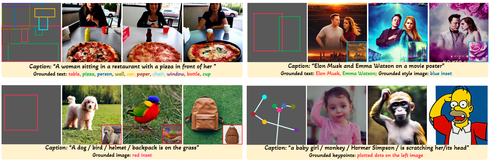

# GLIGEN: Open-Set Grounded Text-to-Image Generation

[Yuheng Li](https://yuheng-li.github.io), [Haotian Liu](https://hliu.cc), [Qingyang Wu](https://scholar.google.ca/citations?user=HDiw-TsAAAAJ&hl=en) [Fangzhou Mu](https://pages.cs.wisc.edu/~fmu/), [Jianwei Yang](https://jwyang.github.io/), [Jianfeng Gao](https://www.microsoft.com/en-us/research/people/jfgao/), [Chunyuan Li*](https://chunyuan.li/), [Yong Jae Lee*](https://pages.cs.wisc.edu/~yongjaelee/)

[[Project Page](https://gligen.github.io/)] [[Demo](https://aka.ms/gligen)] [[Paper](https://arxiv.org/abs/XXXXX)]



Code comming soon.  Stay tuned!

## Citation
```
@article{li2023gligen,
  author      = {Li, Yuheng and Liu, Haotian and Wu, Qingyang and Mu, Fangzhou and Yang, Jianwei and Gao, Jianfeng and Li, Chunyuan and Lee, Yong Jae},
  title       = {GLIGEN: Open-Set Grounded Text-to-Image Generation},
  publisher   = {arXiv:XXXXXXXX},
  year        = {2023},
}
```