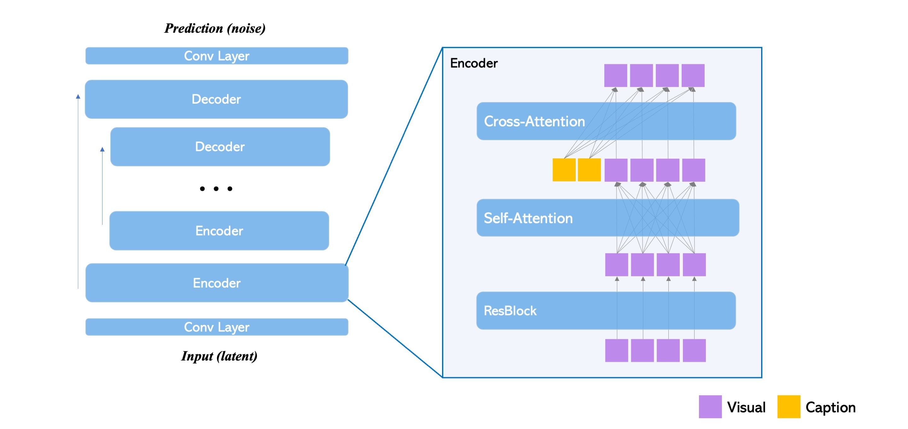
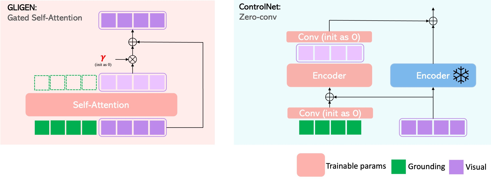

## GLIGEN vs ControlNet

Both [GLIGEN](https://gligen.github.io/) and [ControlNet](https://github.com/lllyasviel/ControlNet) are controllable diffusion models. They only add new leanable parameters to adapt and modify intermediate features in existing diffusion models without changing original weights.  

What is the difference between GLIGEN and Controlnet? At a high-level they are similar, but differ in model design details. The following figure shows the architecture of a U-Net, which is commonly used as the normal diffusion model in this context. It consists of several encoders and decoders. Within each encoder, it sequentially includes a residual block, self-attention layer, and cross-attention layer.

**GLIGEN:** The way GLIGEN introduces new parameters is by adding a gated self-attention layer between the self-attention and cross-attention layers within the encoder. The details of the gated self-attention are depicted in the left part of the following figure.

**ControlNet:** The way ControlNet introduces new parameters is by adding an identical copy of the encoder block, which is depicted in the right part of the following figure.

In the figure below, the green tokens (labeled as "grounding") represent new conditional information, such as bounding boxes, edge maps, etc. 

As one can see, the core difference is: GLIGEN processes **concatenation** of condition and visual features with the **Transformer** layer whereas ControlNet processes **sum** of condition and visual feature which is more suitable for spatially aligned conditions. The design choice conceptually makes GLIGEN a more general form. They both demonstrate impressive results on spatially aligned conditions such as edge map, normal map etc; however, GLIGEN also demonstrates results on discrete conditions such as bounding boxes, reference images etc. 

Note that, in GLIGEN, the conditions (or grounding tokens) need to be processed by external networks. For example: how to encode bounding boxes into grounding tokens or how to encode reference images should be taken care of by other networks. The gated self-attention layer will take in external conditions in the form of tokens, but this layer does not care how those tokens are obtained. In other words, GLIGEN trades more controllability and flexibility with extra external network designing work.
  
